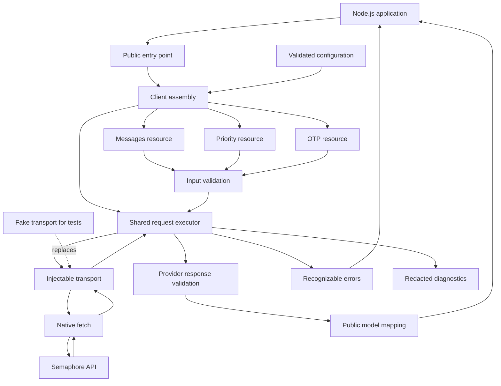

<div align="center">

# Semaphore SMS SDK for TypeScript

### Type-safe SMS integration with clear contracts and predictable request behavior

A TypeScript library for integrating the **Semaphore SMS API** into Node.js applications. Built around **strict types**, **native fetch**, and an **injectable transport**, with a modular architecture for message operations, response validation, and reliable error handling.

[](https://www.npmjs.com/package/semaphore-sdk)
[](https://github.com/pravennn08/semaphore-sdk/releases)
[](https://www.typescriptlang.org/)
[](https://nodejs.org/)
[](https://pnpm.io/)
[](https://vite.dev/)
[](https://vitest.dev/)
[](https://eslint.org/)
[](https://prettier.io/)
[](https://github.com/features/actions)
[](./LICENSE)

[Overview](#overview) · [Installation](#installation) · [Quick Start](#quick-start) · [Project Goals](#project-goals) · [Tech Stack](#technology-stack) · [Environment](#environment) · [Architecture](#architecture) · [Build & Test](#build--test) · [Workflow](#workflow) · [Safety & Compliance](#safety-and-compliance) · [Troubleshooting](#troubleshooting)

</div>

---

> [!WARNING]
> SMS submissions can incur charges and contact real recipients. A timeout or unreadable response does not necessarily mean a message was not accepted. **Send operations must not be automatically retried**, because repeating an uncertain submission can send duplicate messages.

---

## Overview

This project provides a reusable TypeScript interface to the [Semaphore SMS API](https://semaphore.co/), keeping provider-specific HTTP details separate from application code.

The SDK is designed to:

- Expose **strongly typed inputs and outputs** for supported operations.
- Validate configuration, operation inputs, and provider response shapes.
- Centralize authentication, serialization, deadlines, and error handling.
- Use **native fetch** without coupling resources to a specific HTTP implementation.
- Support **fake transports** for deterministic tests without sending real SMS.
- Distinguish provider rejection from **uncertain submission outcomes**.
- Keep sensitive information out of default diagnostic output.
- Publish an explicit **ESM entry point** with TypeScript declarations.

The current implementation includes the **messages**, **priority**, and **OTP** resources. Account and message-retrieval resources can be added later using the same architectural boundaries.

### Development Status

**Current version: `0.2.0`**

The first vertical slice is implemented and tested: client configuration, shared request handling, ordinary SMS and priority message submission, and dedicated OTP submission. Account and message-retrieval resources are planned next.

- Initial module format: **ESM only**
- Library build: **TypeScript compiler (`tsc`)**
- Implemented resources: **Messages, Priority, and OTP**
- Future resource candidates: **Account and message retrieval**
- Supported runtime: Node.js with native `fetch` (the development toolchain is tested with Node.js 22)
- Public API names and package publication details: still subject to change before `1.0.0`

> [!NOTE]
> This is an independent SDK project. It is not presented as an official Semaphore-maintained package.

---

## Installation

Install the published package with npm or pnpm:

```bash
npm install semaphore-sdk
# or
pnpm add semaphore-sdk
```

The SDK is ESM-only and requires Node.js `>=18.17.0`. It uses the runtime's
native `fetch` implementation and does not load `.env` files automatically; load
environment variables in your application and pass the API key to the client.

## Quick start

### Send a standard SMS

```ts
import { SemaphoreClient } from "semaphore-sdk";

const client = new SemaphoreClient({
  apiKey: process.env.SEMAPHORE_API_KEY!,
  defaultSender: process.env.SEMAPHORE_SENDER_NAME,
});

const result = await client.messages.send({
  to: "+639171234567",
  message: "Your verification code is 123456.",
});

console.log(result.data[0]?.messageId);
```

### Send a priority SMS

Priority messages use the same input and output contract as standard SMS while
using Semaphore's priority queue:

```ts
const result = await client.priority.send({
  to: "09171234567",
  message: "Your order is ready for pickup.",
});

console.log(result.data[0]?.status);
```

### Send an OTP

```ts
const result = await client.otp.send({
  to: "09171234567",
  message: "Your login code is {otp}.",
});

console.log(result.data[0]?.code);
```

Keep API keys server-side and treat timeouts, cancellations, and transport
failures as uncertain submission outcomes before deciding whether to send again.

---

## Project Goals

- Build a focused, reusable **Semaphore SMS client** for Node.js.
- Use **strict TypeScript checking** and Node-compatible module resolution.
- Define stable public inputs, outputs, and recognizable error categories.
- Validate actual provider responses before mapping them into public models.
- Support configurable API key, default sender, timeout, and transport.
- Respect request cancellation without implying that cancellation recalls an SMS.
- Keep endpoint-specific behavior inside resource modules.
- Prevent automatic retries of SMS submissions.
- Redact API keys, phone numbers, message bodies, and OTPs from diagnostics.
- Test request behavior without contacting the live provider.
- Verify JavaScript imports and declarations from the built package.
- Run automated checks on pull requests through GitHub Actions.

---

## Technology Stack

| Technology                      | Role                                                           |
| ------------------------------- | -------------------------------------------------------------- |
| **TypeScript**                  | Strict public contracts, implementation, and type declarations |
| **Node.js**                     | Target runtime for server-side SDK consumption                 |
| **ESM**                         | Initial package module format                                  |
| **pnpm**                        | Dependency management with a committed lockfile                |
| **TypeScript compiler (`tsc`)** | Emits library JavaScript and declarations                      |
| **Native fetch**                | Default HTTP implementation                                    |
| **Injectable transport**        | Replaces HTTP exchange for tests or custom integrations        |
| **Vitest**                      | Unit, contract, and package tests                              |
| **Vite**                        | Vite-based tooling used by Vitest; optional example tooling    |
| **ESLint**                      | Static analysis and code-quality checks                        |
| **Prettier**                    | Consistent source formatting                                   |
| **GitHub Actions**              | Pull-request validation and package checks                     |

> [!IMPORTANT]
> **Vite is not the library build tool in this initial design.** The package is built with `tsc`. Vitest provides the Vite-based testing workflow, while library compilation remains separate.

---

## Environment

### Runtime Requirements

- A Node.js release supported by the package and its dependencies
- Native `fetch` support for the default transport
- A Semaphore account and API key for live requests
- Network access to the Semaphore API

The supported Node.js range is `>=18.17.0`, which provides the native `fetch`
runtime used by the default transport. Keep this range synchronized across:

- `package.json` → `engines.node`
- The GitHub Actions test matrix
- Contributor documentation

### Development Requirements

- Node.js
- pnpm at the version declared by the repository
- Git
- VS Code or another TypeScript-capable editor

Commit `pnpm-lock.yaml` and use frozen-lockfile installation in CI.

### Client Configuration

The client configuration layer owns validation and normalization of these options:

| Option                 | Purpose                                                  |
| ---------------------- | -------------------------------------------------------- |
| **API key**            | Authenticates provider requests                          |
| **Default sender**     | Supplies a sender when an operation does not override it |
| **Timeout**            | Bounds the request lifecycle                             |
| **Transport override** | Replaces the default HTTP exchange implementation        |

The current defaults are `timeoutMs: 10_000` and the native global `fetch` transport. The API key must be a nonblank string; a sender name is optional.

```ts
import { SemaphoreClient } from "semaphore-sdk";

const client = new SemaphoreClient({
  apiKey: process.env.SEMAPHORE_API_KEY!,
  defaultSender: process.env.SEMAPHORE_SENDER_NAME,
});

const result = await client.messages.send({
  to: "+639171234567",
  message: "Your verification code is 123456.",
});
```

### Secrets

Load credentials from your application's environment or secret manager:

```bash
SEMAPHORE_API_KEY=your_api_key_here
SEMAPHORE_SENDER_NAME=your_registered_sender_name
```

The environment variable name above is an application convention, not a claim that the SDK automatically reads it.

> [!CAUTION]
> Keep API keys on the server. Do not embed them in browser bundles or `VITE_*` environment variables, which can expose values to client-side code.

---

## Architecture



### Project Structure

The source tree reflects the current implementation.

```text
semaphore-sdk/
├── .github/
│   ├── ISSUE_TEMPLATE/
│   │   ├── bug_report.yml
│   │   ├── config.yml
│   │   └── feature_request.yml
│   └── workflows/
│       └── ci.yml
│
├── src/
│   ├── index.ts
│   ├── client.ts
│   ├── config.ts
│   ├── errors.ts
│   │
│   ├── core/
│   │   ├── request.ts
│   │   ├── transport.ts
│   │   └── redact.ts
│   │
│   └── resource/
│       ├── validation.ts
│       ├── messages/
│       │   ├── resource.ts
│       │   ├── types.ts
│       │   ├── schema.ts
│       │   └── mapper.ts
│       ├── otp/
│       │   ├── resource.ts
│       │   ├── types.ts
│       │   ├── schema.ts
│       │   └── mapper.ts
│       └── priority/
│           ├── resource.ts
│           └── types.ts
│
├── test/
│   ├── unit/
│   ├── contract/
│   ├── fixtures/
│   └── package/
│
├── docs/
│   ├── architecture.md
│   └── api-behavior.md
│
├── examples/
│   ├── README.md
│   ├── send-message.ts
│   ├── send-priority.ts
│   └── send-otp.ts
│
├── package.json
├── pnpm-lock.yaml
├── tsconfig.json
├── tsconfig.build.json
├── vitest.config.ts
├── eslint.config.js
├── .prettierrc.json
├── .gitignore
├── README.md
├── CONTRIBUTING.md
├── SECURITY.md
└── LICENSE
```

### Public Entry Point & Client Assembly

| File            | Responsibility                                                     |
| --------------- | ------------------------------------------------------------------ |
| **`index.ts`**  | Explicitly exports supported client APIs, public types, and errors |
| **`client.ts`** | Assembles configuration, request execution, and resource groups    |
| **`config.ts`** | Defines and validates client options                               |
| **`errors.ts`** | Defines errors applications can reliably recognize                 |

Exporting a symbol creates a compatibility commitment. Keep internal helpers private and expose supported imports through the package export map.

### Messages Resource

| File              | Responsibility                                             |
| ----------------- | ---------------------------------------------------------- |
| **`resource.ts`** | Defines operations and prepares endpoint-specific requests |
| **`types.ts`**    | Defines public operation inputs and outputs                |
| **`schema.ts`**   | Validates inputs and actual provider response shapes       |
| **`mapper.ts`**   | Converts validated provider records into public models     |

If Semaphore changes a message-response field, inspect the resource schema and mapper first.

Keep message-specific types in this resource. Introduce shared types only when multiple resources need the same concept.

### OTP Resource

The OTP resource uses the provider's dedicated `/otp` route and exposes
`client.otp.send()`. It accepts one recipient, a message template, and an
optional custom numeric code. If no code is supplied, the provider generates
one and returns it in the mapped `code` field. Shared recipient, message, and
sender validation lives in `resource/validation.ts`.

### Priority Resource

The priority resource uses Semaphore's `/priority` route and exposes
`client.priority.send()`. It shares the standard SMS input, validation, response
mapping, timeout, cancellation, and error behavior. See the [Semaphore API
documentation](https://www.semaphore.co/docs) for provider-side queue and
credit details.

### Shared Request Core

| File               | Responsibility                                                                                   |
| ------------------ | ------------------------------------------------------------------------------------------------ |
| **`request.ts`**   | Authentication placement, serialization, deadlines, cancellation, parsing, and error translation |
| **`transport.ts`** | Performs the HTTP exchange without knowing message or OTP semantics                              |
| **`redact.ts`**    | Removes sensitive information from diagnostic output                                             |

Resources provide endpoint details and operation semantics. The request executor applies consistent behavior, while the transport only handles the network exchange.

### Dependency Rules

- The client assembles resources and the request executor.
- Resources call the request executor.
- The request executor calls the transport.
- Resource modules never import the client or root entry point.
- The core never imports a particular resource.
- Tests can replace the transport without changing resource code.

These boundaries prevent circular dependencies and contain endpoint-specific changes.

### Error & Submission Semantics

The SDK distinguishes these categories:

| Category                                      | Meaning                                                                    |
| --------------------------------------------- | -------------------------------------------------------------------------- |
| **Configuration error**                       | Invalid client options                                                     |
| **Input validation error**                    | Invalid operation input detected before dispatch                           |
| **Provider rejection**                        | A provider response explicitly reports failure                             |
| **Response validation error**                 | The response cannot be interpreted according to the supported contract     |
| **Transport, timeout, or cancellation error** | The request did not complete normally                                      |
| **Uncertain submission**                      | The provider may have accepted the SMS, but acceptance cannot be confirmed |

A malformed response after dispatch may also represent an uncertain submission. Error classification must consider both the failure and the operation's side effects.

> [!IMPORTANT]
> **Submission acceptance is not delivery confirmation.** Likewise, aborting a local request does not guarantee that the provider stopped processing it.

---

## Build & Test

### 1. Clone the Repository

```bash
git clone https://github.com/pravennn08/semaphore-sdk.git
cd semaphore-sdk
```

### 2. Install Dependencies

```bash
pnpm install --frozen-lockfile
```

Update and commit the lockfile intentionally when changing dependencies.

### 3. Run Development Checks

The repository provides these checks:

```bash
pnpm typecheck
pnpm lint
pnpm format:check
pnpm test
pnpm test:package
```

Suggested script conventions:

```json
{
  "scripts": {
    "typecheck": "tsc --project tsconfig.json --noEmit",
    "build": "tsc --project tsconfig.build.json",
    "lint": "eslint .",
    "format": "prettier --write .",
    "format:check": "prettier --check .",
    "test": "vitest run",
    "test:package": "pnpm build && node test/package/consumer.mjs",
    "test:watch": "vitest"
  }
}
```

### 4. Build the Library

```bash
pnpm build
```

Keep development checking separate from library emission:

- `tsconfig.json` checks development sources and supporting files.
- `tsconfig.build.json` emits library JavaScript and declarations.
- Use strict checking and Node-compatible ESM resolution.
- Exclude tests, fixtures, and examples from library output.

### 5. Define Package Exports

Illustrative package metadata, assuming output is emitted to `dist/`:

```json
{
  "name": "semaphore-sdk",
  "version": "0.2.0",
  "type": "module",
  "files": ["dist"],
  "types": "./dist/index.d.ts",
  "exports": {
    ".": {
      "types": "./dist/index.d.ts",
      "import": "./dist/index.js"
    }
  }
}
```

The package is currently in pre-1.0 development; check the repository releases
for the version and compatibility guarantees of each published package.

### 6. Verify the Packed Artifact

```bash
pnpm pack
```

Install the generated tarball in a small consumer fixture and verify:

- ESM imports resolve in supported Node.js versions.
- TypeScript resolves the public declarations.
- Exported types and runtime exports match.
- Internal source paths are not required.
- Required runtime files are included.
- Credentials, local environment files, and private fixtures are excluded.

> [!NOTE]
> Passing source tests is not enough. A package can have working source code but broken published imports or missing declaration files.

---

## Workflow

### Request Lifecycle

1. **Configure** — Validate API key, sender defaults, timeout, and transport.
2. **Validate input** — Reject invalid operation inputs before dispatch.
3. **Prepare** — The resource provides endpoint details and operation semantics.
4. **Serialize** — The request executor applies the provider's authentication and request format.
5. **Dispatch** — The transport performs the HTTP exchange.
6. **Parse** — The executor handles the HTTP response and payload parsing.
7. **Validate response** — The resource checks the provider response shape.
8. **Map** — Validated records become public SDK models.
9. **Return or classify failure** — The caller receives a result or recognizable error.

Send operations are not automatically retried at any stage.

### Testing Strategy

| Folder               | What It Verifies                                                |
| -------------------- | --------------------------------------------------------------- |
| **`test/unit/`**     | Validation, mapping, configuration, and error classification    |
| **`test/contract/`** | Complete request/response behavior through a fake transport     |
| **`test/fixtures/`** | Clearly identified synthetic or sanitized provider payloads     |
| **`test/package/`**  | Installation, runtime imports, and types from the built package |

Contract tests should cover:

- Successful submission and response mapping
- Authentication and serialization behavior
- Invalid input rejected before dispatch
- Explicit provider rejection
- Unreadable or malformed responses
- Timeout after dispatch
- Cancellation before and after dispatch
- Unfamiliar provider statuses
- No automatic retry after uncertain submission
- Redaction of sensitive diagnostic fields

Fake-transport tests validate the SDK against recorded expectations; they do not prove that the live provider has not changed.

### Continuous Integration

The repository workflow validates each pull request by:

1. Installing the declared Node.js and pnpm versions.
2. Installing dependencies with the committed lockfile.
3. Running type checking, linting, and formatting checks.
4. Running unit and contract tests.
5. Building the library.
6. Packing and testing the consumer artifact.

Default CI must not require live API credentials or send real messages.

### Current Implementation Progress

1. **Complete** — package foundation, strict TypeScript configuration, ESM exports, formatting, linting, and tests.
2. **Complete** — client configuration validation for API key, sender, timeout, and injectable transport.
3. **Complete** — shared form-encoded request executor with authentication, deadlines, cancellation, response validation, rate-limit metadata, and error classification.
4. **Complete** — `client.messages.send()` input validation, Philippine mobile-number normalization, request serialization, and response mapping.
5. **Complete** — package-consumer verification for built JavaScript and declarations, plus the initial CI workflow.
6. **Complete** — `client.otp.send()` with custom-code validation and provider-code response mapping.
7. **Complete** — `client.priority.send()` reuses the validated SMS request and response contract with the provider's priority endpoint.
8. **Next** — add account and message-retrieval resources only after their provider contracts are verified.

### Future Resources

Future resources can follow the same structure:

```text
src/resource/
├── messages/
├── otp/
├── priority/
└── account/
```

Add capabilities only after their provider behavior and public contracts are documented and tested.

---

## Safety and Compliance

> [!CAUTION]
> **API Keys & Personal Data**
>
> - Keep credentials in server-side environment variables or a secret manager.
> - Never commit live API keys or unsanitized provider payloads.
> - Exclude phone numbers, message bodies, API keys, and OTPs from default logs.
> - Avoid exposing raw provider responses through application error handlers.
> - Review packed artifacts for accidental secret inclusion.

> [!WARNING]
> **Duplicate Sends & Uncertain Outcomes**
>
> - Never automatically retry SMS submissions.
> - Do not treat timeout, cancellation, or response parsing failure as proof of non-submission.
> - Application code must handle uncertain outcomes explicitly.
> - Use reconciliation where supported before deciding to send again.
> - Do not claim exactly-once submission without a documented provider mechanism.

> [!IMPORTANT]
> **Responsible Messaging**
>
> - Send messages only to recipients you are authorized to contact.
> - Follow applicable consent, privacy, sender-registration, and messaging requirements.
> - Treat rate limits, account credit, and provider restrictions as operational constraints.
> - Keep live integration tests opt-in and use controlled recipients.
> - A successful submission response does not establish final delivery.

---

## Troubleshooting

| Problem                                      | Likely Cause                                                                    | Solution                                                                     |
| -------------------------------------------- | ------------------------------------------------------------------------------- | ---------------------------------------------------------------------------- |
| **ESM import fails**                         | CommonJS usage or incorrect export paths                                        | Use ESM and verify the built package export map                              |
| **Types cannot be resolved**                 | Missing declarations or incorrect declaration paths                             | Inspect `dist/`, the tarball, and package metadata                           |
| **`fetch` is unavailable**                   | Unsupported runtime                                                             | Use a supported Node.js version or a compatible injected transport           |
| **Provider rejects authentication**          | Invalid credentials or incorrect authentication placement                       | Verify account credentials and the endpoint contract without logging secrets |
| **Provider rejects a message**               | Invalid input, sender restrictions, insufficient credit, or account limitations | Inspect sanitized error details and provider documentation                   |
| **Submission times out**                     | Network delay or provider processing delay                                      | Treat post-dispatch uncertainty explicitly; do not retry automatically       |
| **Response validation fails**                | Provider shape changed or an unexpected payload was returned                    | Inspect a sanitized response and update schemas, mappers, and tests          |
| **Unknown status is returned**               | Provider introduced a new status                                                | Handle it explicitly; do not silently convert it to success                  |
| **Duplicate messages appear**                | Application, queue, or middleware retries sends                                 | Disable blind retries and review uncertain-outcome handling                  |
| **Source tests pass but installation fails** | Missing files or invalid package exports                                        | Test the packed artifact in an isolated consumer fixture                     |
| **CI installation fails**                    | Lockfile differs from dependency metadata                                       | Update dependencies intentionally and commit the resulting lockfile          |
| **Sensitive values appear in logs**          | Raw payloads or errors bypass redaction                                         | Route diagnostics through redaction and add regression tests                 |

---

**A focused TypeScript SDK for Semaphore SMS—with explicit contracts, testable HTTP behavior, and careful handling of uncertain submissions.**
